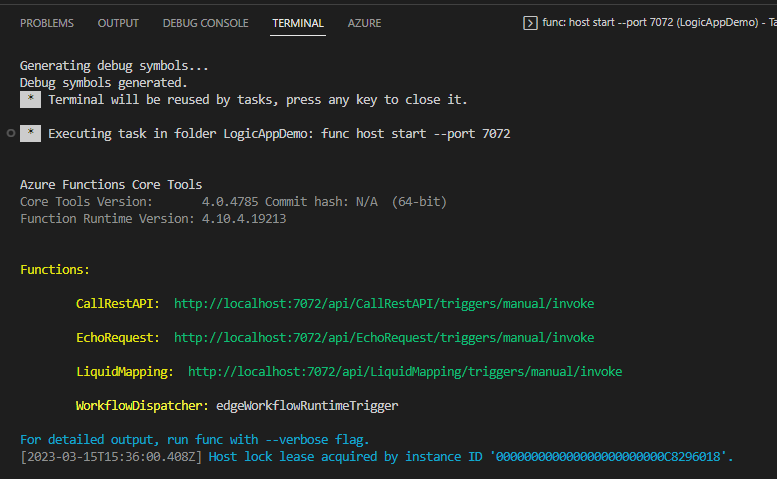

# EchoRequest Workflow
This is a very simple workflow that will simply echo back anything you post to it.

## Running Locally
Go to the debug tab on the left and click the green arrow.

Once the workflow is running, you will see a list of URLs in the terminal window.  These URLs will not work as they do not have the key, api version, etc.  To get the correct URL, go to the file explorer, right click on the workflow.json file in the EchoRequest folder and select overview.

The Overview will show you the URL to use.  Copy the URL, open the tests.http file located in the src\logicappdemo folder, and replace the value for @EchoRequestUrl.

You should be able to test the workflow by clicking on the 'send request' link.  This will call the workflow and open another window to show you the response.

## Running in Azure
It is recomended to use the provided GitHub workflows to deploy your infrastructure and application to Azure.  If you haven't done so already, please review the [GitHub Setup Documentation](SetupAuth.md).  This walks you through using the provided script to setup 95% of what you need.

Alternatively, you can use \src\Infrastructure\infradeploymentscript.ps1 to deploy the necessary infrastructure and deploy the workflows from Visual Studio Code.

Once everything has been deployed, you can get the URL to the workflow from the portal. 

Click on the LogicApp that was deployed, then click on workflows, and finally click on the EchoRequest workflow.  This will bring up a details page showing the workflow URL as well as an option to run the trigger.  You can copy the workflow URL and replace what is in the http.rest file, use postman, etc.

