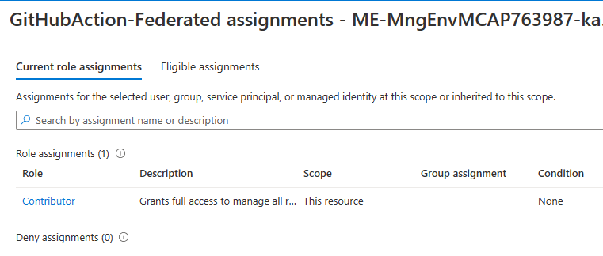
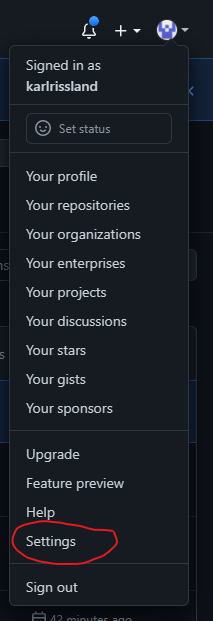
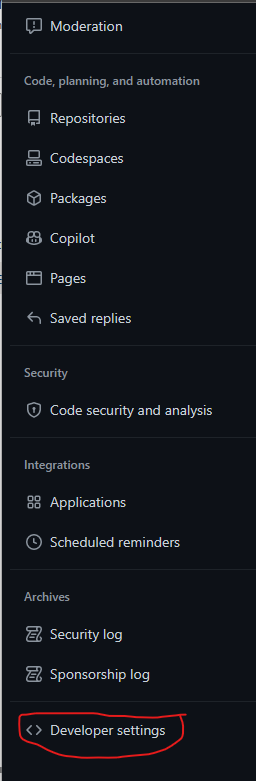
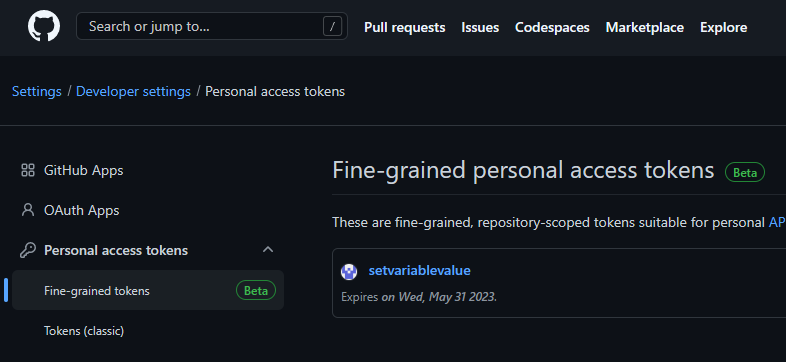
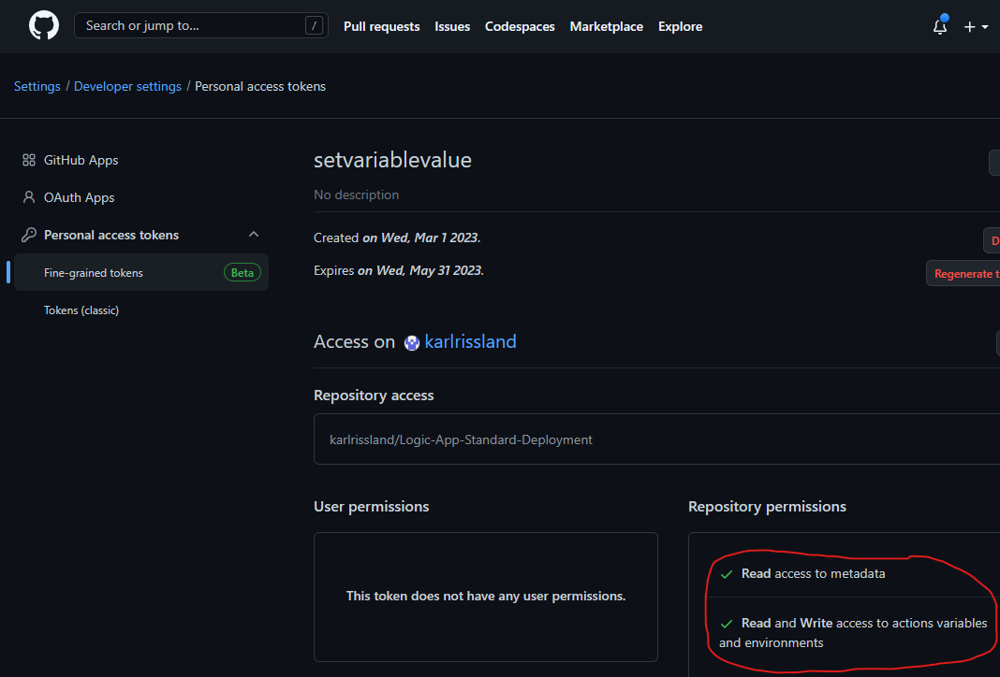

# Configuring GitHub and Azure
If you have forked the repo, there is a little setup that you need to do.  To make this simple, run the powershell script found at \src\infrastructure\setup.ps1.

You will need to have the Azure CLI and the GitHub CLI installed and have logged into both before running the script.

The script will prompt you for your GitHub Org/Owner name and the repository name.

## Overview of what the script does

### In Azure
- Creates an Azure AD App Registration
- Adds 4 Federated Credentials to the App Registration
    - one for the GitHub Repo
    - one for the dev environment
    - one for the test environment
    - one for the production environment

### In GitHub
- Creates 3 Environments
    - Development
    - Test
    - Production

- Creates 4 repository secrets and populates three of them
    - AZURE_CLIENT_ID
    - AZURE_SUBSCRIPTION_ID
    - AZURE_TENANT_ID
    - GH_PAT (Not Populated)

- Creates a Repository Variable
    - HG_REPO_ID

- Creates the following variables for each environment
    - AZURE_REGION
    - LOGICAPPPLAN_NAME (populated by infra scripts)
    - LOGICAPP_NAME (populated by infra scripts)
    - RESOURCEGROUPNAME (populated by infra scripts)
    - WORKLOAD_ENVIRONMENT

## Manual Steps

### Assign RBAC to your app registration
You can reference documentation found here; https://learn.microsoft.com/en-us/azure/active-directory/develop/howto-create-service-principal-portal#assign-the-application-to-a-role.  Basically, we need to give contributor access to the azure resources you are targeting with deployments.  In the screenshot below I am giving the app registration contributor access to the subscription.

NOTE: This example assums you will be using one subscription and different resource groups for your environments.  If needed, a few small changes will enable this demo to work with multiple subscriptions, i.e. a subscription for dev/test and another for production.
NOTE: At some point, I hope to automate this step as well.

### Setup a PAT for the GitHub CLI to use in workflows
In one of the GitHub Workflows we need to use the GitHub CLI to update the variables within the environment.  There is no function in GitHub workflows to do this so we needed to use the CLI to help us call the GitHub rest api.  The default permissions that the GitHub runner uses isn't sufficient for this and there is no way to add those permissions.  Hence, we need to create a PAT and specifically add the permissions we need.

NOTE: An alternative to managing variables in environments would be to use Azure KeyVault, Azure App Configuration, or write back a parameters file to the repo.
NOTE: Currently, the only way to create a PAT is through the GUI.  Hopefully they will update the GitHub runner context such that I can give it permissions it needs rather than using a PAT.

Here are some screenshots to help you setup your PAT

 

When you create the PAT, copy the value you are shown and update the GH_PAT secret with that value.  
