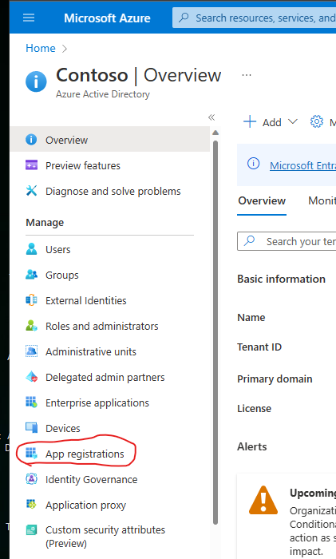

# Configuring GitHub
If you have forked the repo, there is a little setup that you need to do.  At some point I may create a script to do most of this for you, but it is low on the backlog.  You will need to setup some credentials, create a GH PAT, and some Environments.

## Setup OIDC With Azure
The github workflow testAzureConnectivity.yml will test authentication against a windows and ubuntu agent.  For this to correctly authenticate, you need to setup a federated credential and add some action secrets.  At a high level, here is what you need to do;

- Create an App Registration in Azure AD
- Capture the Client_ID, Tenant_ID, and Subscription_ID for later use
- Create several federated credentials
- Give your App Registration (service principle) permisions to do things in Azure
- Create some GitHub Secrets

Follow documentation found here; https://learn.microsoft.com/en-us/azure/developer/github/connect-from-azure

Make sure you assign the service principle access to your subscription and resources.  You can reference documentation found here; https://learn.microsoft.com/en-us/azure/active-directory/develop/howto-create-service-principal-portal#assign-the-application-to-a-role

Some Screenshots for you

NOTE: this example assums you will be using one subscription and different resource groups for your environments.  If needed, a few small changes will enable this demo to work with multiple subscriptions, i.e. a subscription for dev/test and another for production.

## Setup a PAT for the GitHub CLI to use in workflows
In one of the GitHub Workflows we need to use the GitHub CLI to update the variables within the environment.  There is no function in GitHub workflows to do this so we needed to use the CLI to help us call the GitHub rest api.  The default permissions that the GitHub runner uses isn't sufficient for this and there is no way to add those permissions.  Hence, we need to create a PAT and specifically add the permissions we need.

NOTE: An alternative to managing variables in environments woudl be to use Azure KeyVault, Azure App Configuration, or write back a parameters file to the repo.

Here are some screenshots to help you setup your PAT

 

## Create Environments, Variables, and Secrets
### Environments
When manually running the workflows, the system will prompt you to pick from available environments.  Suggested names are 'development', 'test', 'production'.
In the future I may add a matrix to the deployment in order to automatically roll through all three environments, that will require names to match.

### Secrets
Secrets are Action secrets, you will need to create the following;
- AZURE_CLIENT_ID
- AZURE_SUBSCRIPTION_ID
- AZURE_TENANT_ID
- GH_PAT

NOTE: if you are deploying to multiple subscriptions, you will need to create app registrations in each subscription and then move the secrets to their respective environments.

### Variables
Variables are created within the environments, you will need to create the following for each environment;
- AZURE_REGION
- LOGICAPPPLAN_NAME
- LOGICAPP_NAME
- RESOURCEGROUPNAME
- WORKLOAD_ENVIRONMENT

